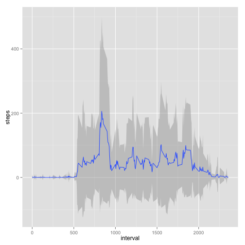

Reproducible Research - Peer Assessment 1
========================================================
Author: Leslie McIntosh  
R Version: 3.1.1  
R Packages Required:
- ggplot2
- plyr
- Hmisc
- rrcovNA


### Loading and preprocessing the data

Load the data into R. Note that I unzipped the data file before I imported it.


```r
activity <- read.table("~/RepData_PeerAssessment1/activity.csv", header=TRUE, sep = ",")
#Convert date formatting
activity$date <- as.Date(activity$date)
#Load required r packages
library(ggplot2)
library(plyr)
library(Hmisc)
```

```
## Warning: package 'Hmisc' was built under R version 3.1.2
```

```
## Loading required package: grid
## Loading required package: lattice
## Loading required package: survival
## Loading required package: splines
## Loading required package: Formula
```

```
## Warning: package 'Formula' was built under R version 3.1.2
```

```
## 
## Attaching package: 'Hmisc'
## 
## The following objects are masked from 'package:plyr':
## 
##     is.discrete, summarize
## 
## The following objects are masked from 'package:base':
## 
##     format.pval, round.POSIXt, trunc.POSIXt, units
```

```r
library(plyr)
library(rrcovNA)
```

```
## Warning: package 'rrcovNA' was built under R version 3.1.2
```

```
## Loading required package: rrcov
```

```
## Warning: package 'rrcov' was built under R version 3.1.2
```

```
## Loading required package: robustbase
```

```
## Warning: package 'robustbase' was built under R version 3.1.2
```

```
## 
## Attaching package: 'robustbase'
## 
## The following object is masked from 'package:survival':
## 
##     heart
## 
## Scalable Robust Estimators with High Breakdown Point (version 1.3-8)
## 
## Scalable Robust Estimators with High Breakdown Point for
## Incomplete Data (version 0.4-7)
```
    
        
            
--------
### What is the mean total number of steps taken per day?

Make a histogram of the total number of steps taken each day


```r
#library(ggplot2)
q <- qplot(date, data=activity, weight=steps, geom="histogram")
q + theme(axis.text.x = element_text(angle = 45, hjust = 1))
```

```
## stat_bin: binwidth defaulted to range/30. Use 'binwidth = x' to adjust this.
```

 

Calculate and report the mean and median total number of steps taken per day


```r
#library(plyr)
ddply(activity, "date", summarise, mean=mean(steps), median=median(steps))
```

```
##          date       mean median
## 1  2012-10-01         NA     NA
## 2  2012-10-02  0.4375000      0
## 3  2012-10-03 39.4166667      0
## 4  2012-10-04 42.0694444      0
## 5  2012-10-05 46.1597222      0
## 6  2012-10-06 53.5416667      0
## 7  2012-10-07 38.2465278      0
## 8  2012-10-08         NA     NA
## 9  2012-10-09 44.4826389      0
## 10 2012-10-10 34.3750000      0
## 11 2012-10-11 35.7777778      0
## 12 2012-10-12 60.3541667      0
## 13 2012-10-13 43.1458333      0
## 14 2012-10-14 52.4236111      0
## 15 2012-10-15 35.2048611      0
## 16 2012-10-16 52.3750000      0
## 17 2012-10-17 46.7083333      0
## 18 2012-10-18 34.9166667      0
## 19 2012-10-19 41.0729167      0
## 20 2012-10-20 36.0937500      0
## 21 2012-10-21 30.6284722      0
## 22 2012-10-22 46.7361111      0
## 23 2012-10-23 30.9652778      0
## 24 2012-10-24 29.0104167      0
## 25 2012-10-25  8.6527778      0
## 26 2012-10-26 23.5347222      0
## 27 2012-10-27 35.1354167      0
## 28 2012-10-28 39.7847222      0
## 29 2012-10-29 17.4236111      0
## 30 2012-10-30 34.0937500      0
## 31 2012-10-31 53.5208333      0
## 32 2012-11-01         NA     NA
## 33 2012-11-02 36.8055556      0
## 34 2012-11-03 36.7048611      0
## 35 2012-11-04         NA     NA
## 36 2012-11-05 36.2465278      0
## 37 2012-11-06 28.9375000      0
## 38 2012-11-07 44.7326389      0
## 39 2012-11-08 11.1770833      0
## 40 2012-11-09         NA     NA
## 41 2012-11-10         NA     NA
## 42 2012-11-11 43.7777778      0
## 43 2012-11-12 37.3784722      0
## 44 2012-11-13 25.4722222      0
## 45 2012-11-14         NA     NA
## 46 2012-11-15  0.1423611      0
## 47 2012-11-16 18.8923611      0
## 48 2012-11-17 49.7881944      0
## 49 2012-11-18 52.4652778      0
## 50 2012-11-19 30.6979167      0
## 51 2012-11-20 15.5277778      0
## 52 2012-11-21 44.3993056      0
## 53 2012-11-22 70.9270833      0
## 54 2012-11-23 73.5902778      0
## 55 2012-11-24 50.2708333      0
## 56 2012-11-25 41.0902778      0
## 57 2012-11-26 38.7569444      0
## 58 2012-11-27 47.3819444      0
## 59 2012-11-28 35.3576389      0
## 60 2012-11-29 24.4687500      0
## 61 2012-11-30         NA     NA
```
--------


### What is the average daily activity pattern?

Make a time series plot (i.e. type = "l") of the 5-minute interval (x-axis)
and the average number of steps taken, averaged across all days (y-axis)


```r
#library(Hmisc)
ggplot(activity,aes(x=interval,y=steps)) +
        stat_summary(fun.data ="mean_sdl", mult=1, geom = "smooth")
```

```
## Warning: Removed 2304 rows containing missing values (stat_summary).
```

 

Which 5-minute interval, on average across all the days in the dataset, contains the maximum number of steps?
(Works fine in R but not in RMarkdown)


```r
#library(plyr)
avg_interval <- ddply(activity, .(interval), summarize,
      mean = mean(steps, na.rm=TRUE))
```

```
## Error in eval(expr, envir, enclos): argument "by" is missing, with no default
```

```r
avg_interval[which(avg_interval$mean == max(avg_interval$mean)), ]
```

```
## Error in eval(expr, envir, enclos): object 'avg_interval' not found
```
--------


### Imputing Missing Values

Calculate and report the total number of missing values in the dataset 
(i.e. the total number of rows with NAs)


```r
sum(!complete.cases(activity))
```

```
## [1] 2304
```

Devise a strategy for filling in all of the missing values in the dataset. The strategy does not need to be sophisticated. For example, you could use the mean/median for that day, or the mean for that 5-minute interval, etc.

Create a new dataset that is equal to the original dataset but with the missing data filled in.

        I used the rrcovNA package for imputation as described in
        http://www.unt.edu/rss/class/Jon/Benchmarks/MissingValueImputation_JDS_Nov2010.pdf
        

```r
#library(rrcovNA) 

summary(activity)
```

```
##      steps             date               interval     
##  Min.   :  0.00   Min.   :2012-10-01   Min.   :   0.0  
##  1st Qu.:  0.00   1st Qu.:2012-10-16   1st Qu.: 588.8  
##  Median :  0.00   Median :2012-10-31   Median :1177.5  
##  Mean   : 37.38   Mean   :2012-10-31   Mean   :1177.5  
##  3rd Qu.: 12.00   3rd Qu.:2012-11-15   3rd Qu.:1766.2  
##  Max.   :806.00   Max.   :2012-11-30   Max.   :2355.0  
##  NA's   :2304
```

```r
activity_imp <- impSeq(activity)
activity_imp <- data.frame(activity_imp)
activity_imp$date <- as.Date(activity_imp$date, origin="1970-01-01")
summary(activity_imp)
```

```
##      steps             date               interval     
##  Min.   :  0.00   Min.   :2012-10-01   Min.   :   0.0  
##  1st Qu.:  0.00   1st Qu.:2012-10-16   1st Qu.: 588.8  
##  Median :  0.00   Median :2012-10-31   Median :1177.5  
##  Mean   : 37.39   Mean   :2012-10-31   Mean   :1177.5  
##  3rd Qu.: 34.43   3rd Qu.:2012-11-15   3rd Qu.:1766.2  
##  Max.   :806.00   Max.   :2012-11-30   Max.   :2355.0
```


Make a histogram of the total number of steps taken each day.
Calculate and report the mean and median total number of steps taken per day. 
Do these values differ from the estimates from the first part of the assignment? 
What is the impact of imputing missing data on the estimates of the total daily
number of steps?


```r
#library(ggplot2)
q2 <- qplot(date, data=activity_imp, weight=steps, geom="histogram")
q2 + theme(axis.text.x = element_text(angle = 90, hjust = 1))
```

```
## stat_bin: binwidth defaulted to range/30. Use 'binwidth = x' to adjust this.
```

 

Calculate and report the mean and median total number of steps taken per day


```r
#library(plyr)
ddply(activity_imp, "date", summarise, mean=mean(steps), median=median(steps))
```

```
##          date       mean   median
## 1  2012-10-01 37.0234056 37.02341
## 2  2012-10-02  0.4375000  0.00000
## 3  2012-10-03 39.4166667  0.00000
## 4  2012-10-04 42.0694444  0.00000
## 5  2012-10-05 46.1597222  0.00000
## 6  2012-10-06 53.5416667  0.00000
## 7  2012-10-07 38.2465278  0.00000
## 8  2012-10-08 37.1080158 37.10802
## 9  2012-10-09 44.4826389  0.00000
## 10 2012-10-10 34.3750000  0.00000
## 11 2012-10-11 35.7777778  0.00000
## 12 2012-10-12 60.3541667  0.00000
## 13 2012-10-13 43.1458333  0.00000
## 14 2012-10-14 52.4236111  0.00000
## 15 2012-10-15 35.2048611  0.00000
## 16 2012-10-16 52.3750000  0.00000
## 17 2012-10-17 46.7083333  0.00000
## 18 2012-10-18 34.9166667  0.00000
## 19 2012-10-19 41.0729167  0.00000
## 20 2012-10-20 36.0937500  0.00000
## 21 2012-10-21 30.6284722  0.00000
## 22 2012-10-22 46.7361111  0.00000
## 23 2012-10-23 30.9652778  0.00000
## 24 2012-10-24 29.0104167  0.00000
## 25 2012-10-25  8.6527778  0.00000
## 26 2012-10-26 23.5347222  0.00000
## 27 2012-10-27 35.1354167  0.00000
## 28 2012-10-28 39.7847222  0.00000
## 29 2012-10-29 17.4236111  0.00000
## 30 2012-10-30 34.0937500  0.00000
## 31 2012-10-31 53.5208333  0.00000
## 32 2012-11-01 37.3981076 37.39811
## 33 2012-11-02 36.8055556  0.00000
## 34 2012-11-03 36.7048611  0.00000
## 35 2012-11-04 37.4343691 37.43437
## 36 2012-11-05 36.2465278  0.00000
## 37 2012-11-06 28.9375000  0.00000
## 38 2012-11-07 44.7326389  0.00000
## 39 2012-11-08 11.1770833  0.00000
## 40 2012-11-09 37.4948049 37.49480
## 41 2012-11-10 37.5068921 37.50689
## 42 2012-11-11 43.7777778  0.00000
## 43 2012-11-12 37.3784722  0.00000
## 44 2012-11-13 25.4722222  0.00000
## 45 2012-11-14 37.5552407 37.55524
## 46 2012-11-15  0.1423611  0.00000
## 47 2012-11-16 18.8923611  0.00000
## 48 2012-11-17 49.7881944  0.00000
## 49 2012-11-18 52.4652778  0.00000
## 50 2012-11-19 30.6979167  0.00000
## 51 2012-11-20 15.5277778  0.00000
## 52 2012-11-21 44.3993056  0.00000
## 53 2012-11-22 70.9270833  0.00000
## 54 2012-11-23 73.5902778  0.00000
## 55 2012-11-24 50.2708333  0.00000
## 56 2012-11-25 41.0902778  0.00000
## 57 2012-11-26 38.7569444  0.00000
## 58 2012-11-27 47.3819444  0.00000
## 59 2012-11-28 35.3576389  0.00000
## 60 2012-11-29 24.4687500  0.00000
## 61 2012-11-30 37.7486353 37.74864
```
--------


### Assess weekend influence

Create a new factor variable in the dataset with two levels – “weekday”
and “weekend” indicating whether a given date is a weekday or weekend day.


```r
activity_imp$weekdays <- weekdays(activity_imp$date)

weekend_l <- c("Saturday", "Sunday")
activity_imp$weekend <- ifelse(activity_imp$weekdays %in% weekend_l, 
                        c("weekend"), c("weekday"))
table(activity_imp$weekdays, activity_imp$weekend)
```

```
##            
##             weekday weekend
##   Friday       2592       0
##   Monday       2592       0
##   Saturday        0    2304
##   Sunday          0    2304
##   Thursday     2592       0
##   Tuesday      2592       0
##   Wednesday    2592       0
```

Make a panel plot containing a time series plot (i.e. type = "l") of the
5-minute interval (x-axis) and the average number of steps taken, averaged
across all weekday days or weekend days (y-axis).


```r
ggplot(activity_imp,aes(x=interval,y=steps)) +
        stat_summary(fun.data ="mean_sdl", mult=1, geom = "smooth") +
        facet_wrap(~ weekend, ncol=1)
```

 
